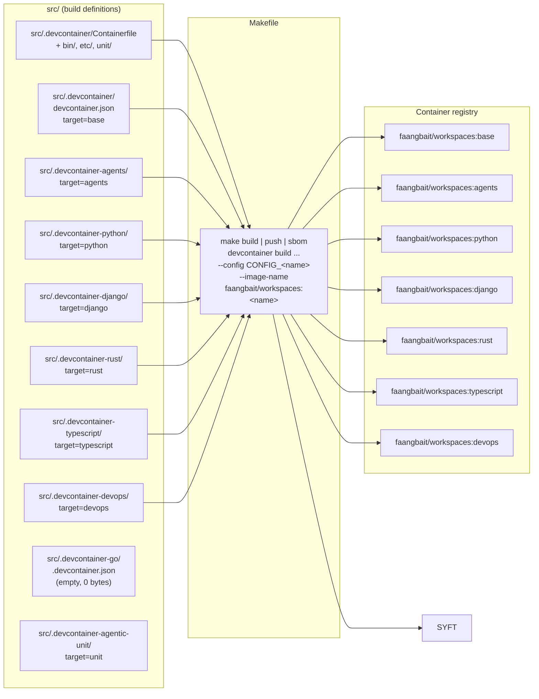

# Repository Diagrams

Two views of the repo: the container **build lineage** (the core value,
ADR003 maturity ordering) and the **repo layout / publish flow**
(how `src/` configs become `faangbait/workspaces:*` images consumed by
`.devcontainer/`).

## 1. Containerfile Build Lineage

`src/.devcontainer/Containerfile` (codename SOL) is one multi-stage
Dockerfile. Most published images compose a language `*-core` stage with
`agents-payload` (dotted) and the `userland-setup` last slice; `base`
drops the agents payload, and `agents` is `FROM agents-payload` itself.
Maturity flows top-to-bottom: mature inputs first, mutable last (ADR003).

```mermaid
flowchart TD

    %% --- remote / upstream inputs (mature -> mutable) ---
    UBI10["registry.access.redhat.com/ubi10:latest"]
    UBIMIN["ubi10/ubi-minimal:latest"]
    RG["ripgrep 15.2.0 release tarball"]
    YQ["yq latest binary"]
    ST["smart-tree install.sh"]
    CODEX["codex install.sh"]
    RTK["rtk v0.43.0 tarball"]
    RUSTUP["rustup-init static"]
    GO["go1.25.5 tarball"]
    TF["terraform 1.15.8"]
    KCTL["kubectl v1.36.2"]
    TFLINT["tflint v0.64.0"]
    TFMCP["terraform-mcp-server 1.1.0"]

    %% --- scratch payload stages (COPY --from later) ---
    ripgrep["ripgrep-payload<br/>(scratch)"]
    userland["userland-setup<br/>(scratch)<br/>yq, rg, aws-profile,<br/>post-create/attach,<br/>context-mode.json, aliases"]
    unit["unit<br/>(scratch, MOCK_DATA.csv)<br/>targeted by<br/>.devcontainer-agentic-unit"]

    RG --> ripgrep
    YQ --> userland
    ripgrep --> userland

    %% --- builder-agents: resolves standalone agent bins in a scratch prefix ---
    builder["builder-agents<br/>(ubi10)<br/>nodejs24 + npm<br/>claude, opencode, codex, bun"]
    UBI10 --> builder
    ST --> builder
    CODEX --> builder
    RTK --> builder

    %% --- base-core: shared root of all language stages ---
    basecore["base-core<br/>(ubi-minimal)<br/>dnf core pkgs<br/>+ nodejs24 + python3.14"]
    UBIMIN --> basecore

    %% --- agents-payload: pipx + npm agent tooling on top of base-core ---
    agentspayload["agents-payload<br/>(FROM base-core)<br/>spec-kitty-cli,<br/>code-review-graph,<br/>context-mode,<br/>opencode auth, rtk"]
    basecore --> agentspayload
    builder -->|COPY /mnt/agents-bin| agentspayload

    %% --- language cores: each FROM base-core, cacheable independently ---
    pythoncore["python-core<br/>(FROM base-core)"]
    rustcore["rust-core<br/>(FROM base-core)<br/>rustup + cargo-nextest"]
    tscore["typescript-core<br/>(FROM base-core)<br/>typescript, tsx, eslint"]
    devopscore["devops-core<br/>(FROM base-core)<br/>terraform, kubectl,<br/>tflint, terraform-mcp"]
    golangcore["golang-core<br/>(FROM base-core)<br/>go + gopls + delve"]
    djangocore["django-core<br/>(FROM python-core)<br/>+ dart-sass"]

    basecore --> pythoncore
    pythoncore --> djangocore
    RUSTUP --> rustcore
    basecore --> rustcore
    basecore --> tscore
    TF --> devopscore
    KCTL --> devopscore
    TFLINT --> devopscore
    TFMCP --> devopscore
    basecore --> devopscore
    GO --> golangcore
    basecore --> golangcore

    %% --- published targets: core + agents-payload + userland-setup ---
    T_base["<b>base</b><br/>FROM base-core"]
    T_agents["<b>agents</b><br/>FROM agents-payload"]
    T_python["<b>python</b><br/>FROM python-core"]
    T_django["<b>django</b><br/>FROM django-core"]
    T_rust["<b>rust</b><br/>FROM rust-core"]
    T_ts["<b>typescript</b><br/>FROM typescript-core"]
    T_devops["<b>devops</b><br/>FROM devops-core"]
    T_go["<b>golang</b><br/>(not in Makefile<br/>TARGETS yet)<br/>FROM golang-core"]

    basecore --> T_base
    agentspayload --> T_agents
    pythoncore --> T_python
    djangocore --> T_django
    rustcore --> T_rust
    tscore --> T_ts
    devopscore --> T_devops
    golangcore --> T_go

    %% every target layers agents-payload + userland-setup last
    agentspayload -.->|COPY /opt/agents| T_python
    agentspayload -.-> T_django
    agentspayload -.-> T_rust
    agentspayload -.-> T_ts
    agentspayload -.-> T_devops
    agentspayload -.-> T_go
    userland -.->|COPY / | T_base
    userland -.-> T_agents
    userland -.-> T_python
    userland -.-> T_django
    userland -.-> T_rust
    userland -.-> T_ts
    userland -.-> T_devops
    userland -.-> T_go

    classDef scratch fill:#fef3c7,stroke:#92400e
    classDef core fill:#dbeafe,stroke:#1e40af
    classDef lang fill:#dcfce7,stroke:#166534
    classDef target fill:#fce7f3,stroke:#9d174d
    classDef upstream fill:#f3f4f6,stroke:#4b5563

    class ripgrep,userland,unit scratch
    class basecore,agentspayload,builder core
    class pythoncore,djangocore,rustcore,tscore,devopscore,golangcore lang
    class T_base,T_agents,T_python,T_django,T_rust,T_ts,T_devops,T_go target
    class UBI10,UBIMIN,RG,YQ,ST,CODEX,RTK,RUSTUP,GO,TF,KCTL,TFLINT,TFMCP upstream
```

**Key invariants**

- `userland-setup` is the **last slice** (ADR002: sloppy before copy, cache
  gets droppied). Nothing in it depends on anything else in the Dockerfile.
- Language cores never inherit `agents-payload`. Agents are layered on top
  of the cached language layer only in the published target.
- `builder-agents` runs as unprivileged uid 10000 so no root-owned files
  leak into the final image.
- `golang` stage exists in the Containerfile but is **not** wired into the
  Makefile `TARGETS` list (see section 2).

## 2. Repo Layout and Publish Flow

`src/.devcontainer-<name>/devcontainer.json` each point at the shared
Containerfile with a different `build.target`. The Makefile builds/sboms
each target. The repo-root `.devcontainer/devcontainer.json` is the
meta-wrapper consumers actually open: it just pulls a published image.

**Notes**

- The Makefile `TARGETS` list (`base agents python django rust typescript
  devops`) is the source of truth for what gets built and SBOM'd.
- `src/.devcontainer-agentic-unit/devcontainer.json` is a complete config
  targeting the `unit` stage (scratch + `MOCK_DATA.csv`). It is **not** in the
  Makefile `TARGETS` list, so it is never built or SBOM'd by `make`.
- `src/.devcontainer-go/.devcontainer.json` (note: dotfile name) exists but is
  **empty** (0 bytes). The `golang`/`golang-core` Containerfile stages are
  fully defined but unwired: no working devcontainer config, no Makefile entry.
- `sbom/*.spdx.json` are generated artifacts, one per published target.
- `docs/ADR001..003` record the design rules encoded above (prebuild
  pattern, FROM-early/COPY-late, maturity-ordered lineage).
