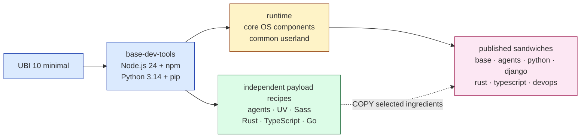
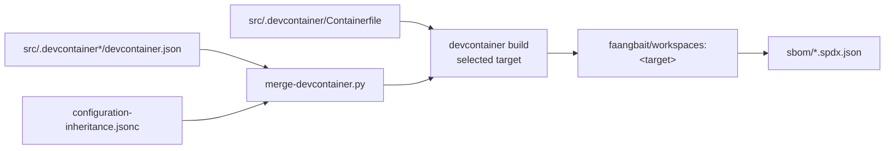

# Build Architecture

The Containerfile builds sandwiches, not a lineage of increasingly specialized
images. Every published target starts with the same runtime bread and copies in
only the independent payloads it needs.

## 1. The kitchen


```mermaid
flowchart LR
    UBI["UBI 10 minimal"] --> DEVTOOLS["base-dev-tools<br/>Node.js 24 + npm<br/>Python 3.14 + pip"]

    DEVTOOLS --> RUNTIME["runtime<br/>core OS components<br/>common userland"]
    DEVTOOLS --> PAYLOADS["independent payload recipes<br/>agents · UV · Sass<br/>Rust · TypeScript · Go"]

    RUNTIME --> TARGETS["published sandwiches<br/>base · agents · python · django<br/>rust · typescript · devops"]
    PAYLOADS -. "COPY selected ingredients" .-> TARGETS

    classDef stable fill:#dbeafe,stroke:#1e40af
    classDef editable fill:#fef3c7,stroke:#92400e
    classDef payload fill:#dcfce7,stroke:#166534
    classDef target fill:#fce7f3,stroke:#9d174d

    class UBI,DEVTOOLS stable
    class RUNTIME editable
    class PAYLOADS payload
    class TARGETS target
```

There are two intentional kinds of dependency:

1. `base-dev-tools` is the stable execution contract. Node/npm and lightweight
   Python are useful in every workspace and rarely change.
2. Every payload recipe may use that contract while it builds, but payloads do
   not inherit from one another or from the frequently edited `runtime` stage.

The core-components list lives in `runtime`, after `base-dev-tools`. Adding a
shell utility therefore leaves npm, Python, and every expensive payload build
cached.

## 2. Ingredient matrix

All targets include the runtime bread: core OS tools, Node.js 24/npm, Python
3.14/pip, and common userland files.

| Target | Agents | UV | Sass | Rust | TypeScript | Go | Target-local config |
|---|:---:|:---:|:---:|:---:|:---:|:---:|---|
| `base` |  |  |  |  |  |  |  |
| `agents` | ✓ |  |  |  |  |  |  |
| `python` | ✓ | ✓ |  |  |  |  |  |
| `django` | ✓ | ✓ | ✓ |  |  |  | `django-manage` |
| `rust` | ✓ |  |  | ✓ |  |  |  |
| `typescript` | ✓ |  |  |  | ✓ |  |  |
| `devops` | ✓ | ✓ | ✓ |  |  |  | `tf` alias |
| `golang` | ✓ |  |  |  |  | ✓ |  |

Python in the runtime is deliberately small. Specialized packages such as
`psycopg2`, Cython, and Requests are project dependencies, not properties of
every sandbox.

`golang` is a valid Containerfile target but is not currently listed in the
Makefile's published `TARGETS`. The `unit` scratch target is a fixture for the
agentic-unit configuration and is not a runtime sandwich.

## 3. Cache boundaries

| Input changed | Rebuilt | Remains cached |
|---|---|---|
| Core-components package list | `runtime` and cheap target assembly | Node/npm, Python, all payload recipes |
| One agent installer/package | That agent slice, agent gather stage, target assembly | Other agents and all language payloads |
| Rust or `cargo-nextest` | Rust payload and Rust assembly | Runtime and every other payload |
| Go, `gopls`, or Delve | Go payload and Go assembly | Runtime and every other payload |
| Common userland file | Runtime copy and target assembly | Package installs and all payload recipes |
| Node/Python runtime version | All stages branching from `base-dev-tools` | Remote scratch payloads |

Payloads are copied with `COPY --link` where their destination is self-contained.
This allows BuildKit to rebase and reuse payload layers without reading the
previous filesystem state.

## 4. Repository and publish flow

The configuration inheritance graph merges editor settings, features, mounts,
and environment variables. It does not define Docker image inheritance.


```mermaid
flowchart LR
    CONFIGS["src/.devcontainer*/devcontainer.json"] --> MERGE["merge-devcontainer.py"]
    GRAPH["configuration-inheritance.jsonc"] --> MERGE
    CONTAINERFILE["src/.devcontainer/Containerfile"] --> BUILD["devcontainer build<br/>selected target"]
    MERGE --> BUILD
    BUILD --> IMAGES["faangbait/workspaces:&lt;target&gt;"]
    IMAGES --> SBOM["sbom/*.spdx.json"]
```

The Makefile `TARGETS` list is the source of truth for published images. Each
target's `devcontainer.json` selects the correspondingly named final stage.

## 5. Shell environment

Every sandwich ships a loader at `/etc/shell-env.sh` that sources every `*.sh`
file in `/etc/shell-env.d`. The directory is the whole contract: drop a file in,
it lands in your environment.

`base` mounts the named volume `portable-shell-env` at that path, so drop-ins
survive rebuilds and are shared by every container on the same Docker daemon.
The volume mounts root-owned on first create; `devcontainer-post-create` claims
it for the runtime user.

```sh
# /etc/shell-env.d/gh.sh
export GH_TOKEN=...
```

The loader is wired into each shell family separately, because each consults
only its own startup hook:

| Shell | Hook |
|---|---|
| bash, login | `/etc/profile` → `/etc/profile.d/shell-env.sh` |
| bash, interactive | `/etc/bashrc` → `/etc/profile.d/shell-env.sh` |
| bash, script | `$BASH_ENV` |
| sh, interactive | `$ENV` |
| zsh, any mode | `/etc/zshenv` |

Non-interactive `#!/bin/sh` scripts have no hook in any shell; they inherit the
variables from their parent process instead.

Fragments must be export-only and silent. The loader runs in non-interactive
shells, so anything a fragment prints lands inside the `$(...)` capture of
unrelated scripts.

Secrets belong in the volume, never in the image and never in a committed
`devcontainer.json`. No `ARG`, no `ENV`, no `containerEnv`.

## 6. Design rules

- New published targets must use `FROM runtime AS <target>`.
- Published targets never inherit from another published target.
- Expensive or independently changing acquisitions get their own payload stage.
- Payloads expose files; runtime metadata such as `PATH`, `PYTHONPATH`, `GOROOT`,
  and `CARGO_HOME` belongs to the final target.
- A payload may rely on the stable `base-dev-tools`, but not on another
  payload or the mutable core-components layer.
- Keep stable inputs early and floating installers late within each payload
  recipe, as described by ADR003.

See [ADR002](ADR002.md), [ADR003](ADR003.md), and [ADR004](ADR004.md).
